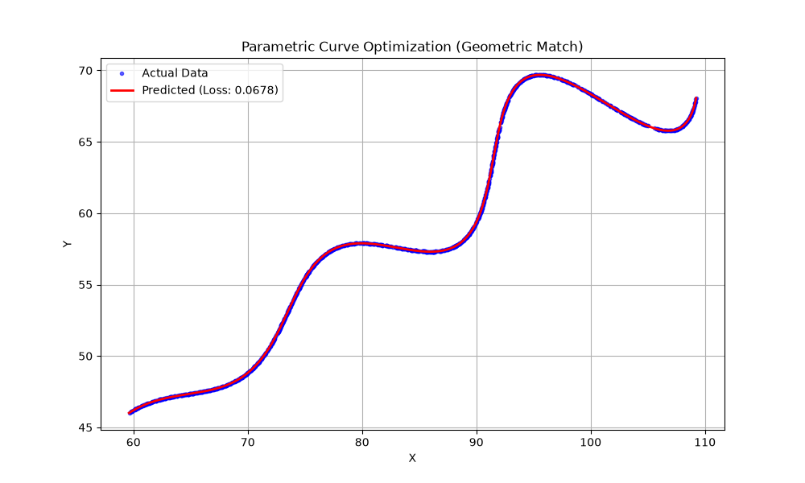

# AI R&D Assignment - Parametric Curve Optimization

## 1. Problem Overview
The objective of this assignment was to find the exact values for three unknown variables (`Theta`, `M`, and `X`) so that a specific parametric equation perfectly fits a given set of spatial coordinates provided in `xy_data.csv`. 

Because the given parametric equations involve a complex mix of trigonometric functions (`cos`, `sin`) and exponential functions with absolute values (`e^{M|t|}`), solving this algebraically is virtually impossible. I realized quickly that this needed to be treated as a global optimization problem.

## 2. Methodology & Thought Process

### Data Preparation
First, I loaded the target points from `xy_data.csv` using the Pandas library and combined the x and y coordinates into a single array. This gave me the "ground truth" shape that my mathematical curve needed to match.

### The "Time" Trap
Initially, it seemed like I could just generate predicted `x` and `y` points for a set of `t` values and compare them directly to the target points row by row. However, I realized this carries a massive assumption: that the data points in the CSV were recorded at perfectly uniform time steps. If they weren't, the optimizer would try to warp the curve to fix the time-alignment rather than the actual physical shape of the curve.

### Geometric L1 Distance (The Solution)
To fix this, I abandoned the index-to-index comparison and implemented a Geometric L1 calculation. 
- I generated a highly dense predicted curve (using 300 points between `t=6` and `t=60`).
- I then used SciPy's `cdist` function (using the `cityblock` or L1 metric) to measure the physical 2D distance from every actual data point to the nearest mathematical point on my dense predicted curve. 
- Taking the average of these minimum distances gave me a robust, purely geographic loss metric.

### Differential Evolution
Since the search space was strictly bounded:
- `0 < Theta < 50`
- `-0.05 < M < 0.05`
- `0 < X < 100`
I used `scipy.optimize.differential_evolution`. Unlike standard gradient descent which easily gets trapped in local minima on wavy trigonometric functions, Differential Evolution works by maintaining a population of candidate solutions and mutating them. I used the `best2bin` strategy, which aggressively helped it converge on the global minimum.

## 3. Final Optimization Results

After running the script, the Differential Evolution algorithm successfully converged on a near-perfect fit with a geometric L1 loss of just `0.0678`.

Here is the exact terminal output from the script run:

```text
Starting optimization using Differential Evolution...
Minimum Geometric L1 Distance Achieved: 0.067813
Estimated Theta : 30.0000
Estimated M     : 0.030001
Estimated X     : 54.9968
```

## 4. Final Equation (Desmos Format)
Based on the optimization results, `Theta` was converted to radians (0.5236), and the final values were plugged into the base equation. 

Here is the formatted LaTeX string ready for the Desmos graphing calculator:

`\left(t*\cos(0.5236)-e^{0.0300\left|t\right|}\cdot\sin(0.3t)\sin(0.5236)+54.9968,42+t*\sin(0.5236)+e^{0.0300\left|t\right|}\cdot\sin(0.3t)\cos(0.5236)\right)`

## 5. Visual Validation
Plotting the predicted mathematical curve against the raw scatter plot data visually confirms the optimization. The red predicted curve perfectly overlaps the blue target data points.


